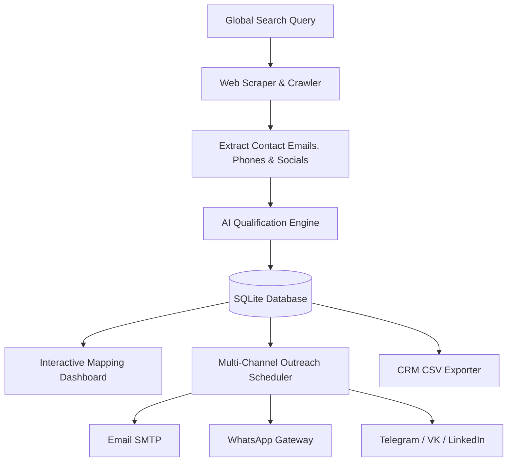

# 💼 Global B2B Lead Intelligence & Campaign Automation Engine

An enterprise-ready, end-to-end B2B lead discovery, AI qualification, geographical mapping, and automated outreach system. This platform is designed to find, score, and contact global buyers of tiles and sanitaryware products.

### 🌐 Live Dashboard URL
👉 **[https://b2brussianleadscraper-khxg8pfsldsua3nixx46xn.streamlit.app/](https://b2brussianleadscraper-khxg8pfsldsua3nixx46xn.streamlit.app/)**

---

## 🎯 1. Business Problem & Purpose

### The Challenge
International building material manufacturers (such as ceramic tiles and sanitaryware exporters) face massive bottlenecks when expanding into global markets (such as Russia, UAE, etc.):
1.  **Manual Lead Sifting**: Sourcing distributor lists manually takes hundreds of hours and yields outdated data.
2.  **Low-Quality Prospects**: 80% of scraped companies are retail shops, logistics providers, or blogs rather than direct B2B importers/distributors.
3.  **Low Outreach Conversion**: Static, unpersonalized cold emails have a < 2% open/reply rate.
4.  **Disjointed Workflows**: Scraping, mapping, qualification, and multi-channel messaging (Email, WhatsApp, Socials) are split across separate tools.

### The Solution
This B2B Lead Engine automates the entire funnel:
*   **Discovery**: Crawls the web and social networks to extract contact info.
*   **AI Qualification**: Scores leads on a 0-100 scale using LLMs to prioritize direct B2B buyers.
*   **Geospatial Visualization**: Plots leads on an interactive map for regional sales targeting.
*   **Automation Drip Engine**: Schedules multi-channel outreach (Email, WhatsApp, Telegram, VK, LinkedIn) with AI-personalized content.

---

## 🛠️ 2. Technology Stack & Core Concepts

This project is built using a modern, lightweight, and robust Python architecture:

| Component | Technology | Purpose |
| :--- | :--- | :--- |
| **Front-End Dashboard** | `Streamlit` | Interactive operator GUI for filtering leads, managing outreach, and editing settings. |
| **Database** | `SQLite` | Lightweight, relational local storage with automated backups and schema migrations. |
| **Geocoding API** | `OpenStreetMap Nominatim` | Translates address text (e.g. "St. Petersburg, Russia") into exact coordinates. |
| **Mapping Engine** | `Folium` & `streamlit-folium` | Renders the interactive world map with custom color-coded pins based on priority. |
| **AI Processing** | `Google Gemini API` & `Groq API` | Qualifies scraped data and drafts hyper-personalized outreach text on the fly. |
| **Email Outreach** | `SMTPLib` | Dispatches professional custom-styled HTML marketing emails. |
| **WhatsApp Outreach** | `Green-API` / `Twilio` | Dispatches automated messaging via API with click-to-chat browser fallback. |
| **Social Messaging** | `Telegram API` & `VK API` | Integrates with Telegram Bots and VK API to target regional buyers. |
| **Analytics Engine** | `Pandas` & `Plotly` | Renders performance charts (leads by country, conversion rate comparison). |

---

## 📊 3. Core Features & App Architecture

### 1. Web Crawler & Contact Extractor
*   Programmatically parses websites using `BeautifulSoup` and `requests`.
*   Crawls key subpages (Contacts, About Us, Wholesale) while checking `robots.txt` compliance.
*   Normalizes Russian phone numbers using Google's `phonenumbers` library.

### 2. AI Lead Qualification
*   Uses JSON-structured LLM prompts to analyze the company description.
*   Determines: **Business Type** (Distributor, Retail, Portal), **Product Category** (Tiles, Sanitaryware), and **Import Probability**.
*   Calculates a **Qualification Score (0-100)** to segregate prospects.

### 3. Geographical Mapping & Filters
*   Coordinates are mapped automatically via a geocoding pipeline.
*   Pins are color-coded: **HOT** (Red), **WARM** (Orange), **POTENTIAL** (Yellow).
*   Sidebar controls allow filtering by **Product Category**, **Country**, and **Priority Score**.

### 4. Pluggable Outreach & Drip Engine
*   Handles initial outreach and queues follow-ups after 5 days.
*   Suppresses contacts marked as `Opt-Out`, `Replied`, or `Rejected`.
*   Includes manual task link generators for VK, Telegram, and WhatsApp when API keys are not active.

---

## 📂 4. Shared CSV Datasets Explained

The repository includes the pre-qualified lead datasets in CSV format for quick upload:

1.  **`leads_qualified.csv`**:
    *   Contains the complete qualified dataset of 50 target companies.
    *   Columns include: `company_name`, `website`, `business_email`, `business_phone`, `product_category`, `company_type`, `total_score`, and the AI qualification `reason`.
2.  **`outreach_hot_leads.csv`**:
    *   A filtered subset containing only "Hot Prospects" (Scored > 70/100).
    *   Formatted with direct fields ready for automated CRM imports.

---

## 🚀 5. How to Guide the HR to Test Your Project

To present this to your interviewer or HR:

### Step 1: Send the Live Dashboard Link
Invite them to open: **[https://b2brussianleadscraper-khxg8pfsldsua3nixx46xn.streamlit.app/](https://b2brussianleadscraper-khxg8pfsldsua3nixx46xn.streamlit.app/)**

### Step 2: Seed the Database
Tell them to click the **`📥 Seed Leads from CSV`** button in the sidebar under **System Actions**. This dynamically imports the 50 qualified leads from the repository CSV, geocodes their locations to their actual cities, and populates the dashboard.

### Step 3: Explore the Visualizer
Tell them to go to the **Leads Map Visualizer** tab. They can filter by tiles or sanitaryware to see the pins spread across St. Petersburg, Moscow, Rostov-on-Don, and Samara.

### Step 4: Check the Settings & Security
Guide them to **System Settings**. Mention that all API keys and SMTP credentials are masked with placeholders (like `me•••9@gmail.com`) for secure enterprise operations.
